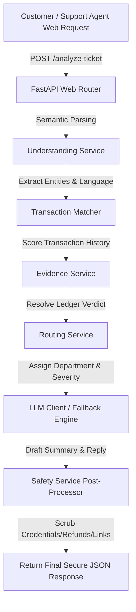
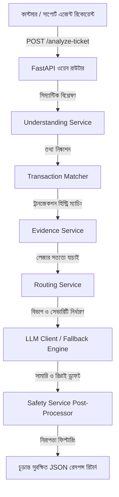

# QueueStorm Investigator — SupportOps Copilot & Fraud Protection Engine

*Scroll down for the Bengali version of this documentation (বাংলা সংস্করণের জন্য নিচে স্ক্রোল করুন)।*

---

## English Documentation Table of Contents
1. [Project Overview](#1-project-overview)
2. [Technology Stack](#2-technology-stack)
3. [Project Architecture](#3-project-architecture)
4. [Installation Guide](#4-installation-guide)
5. [How to Run the Project](#5-how-to-run-the-project)
6. [API Documentation](#6-api-documentation)
7. [Project Workflow](#7-project-workflow)
8. [Folder Structure](#8-folder-structure)
9. [Environment Variables](#9-environment-variables)
10. [Configuration](#10-configuration)
11. [Testing Guide](#11-testing-guide)
12. [Deployment Guide](#12-deployment-guide)
13. [Security](#13-security)
14. [Troubleshooting](#14-troubleshooting)
15. [FAQ](#15-faq)
16. [Future Improvements](#16-future-improvements)
17. [License](#17-license)
18. [Contributors](#18-contributors)

---

## 1. Project Overview
* **Project Name**: QueueStorm Investigator
* **Purpose**: Serves as a digital finance SupportOps copilot designed to analyze customer support tickets alongside transaction logs to automate triaging, inconsistency detection, and drafting safe responses.
* **Problem Statement**: During high-volume campaigns, digital finance support agents are overwhelmed by tickets containing mixed languages (Bangla, English, Banglish). Unsafe replies could promise unauthorized refunds or leak PIN/OTP credentials.
* **Objectives**: Automatically classify ticket case types, verify claim consistency against transaction history, route to correct departments, calculate severity, flag human review, and generate secure multilingual customer replies.
* **Key Features**: 
  - Bilingual Semantic Understanding (detects English, Bangla, and Banglish).
  - Programmatic Transaction Matching and Multi-factor Scoring.
  - Automatic Duplicate Payment Detection (detects identical payments within 10 minutes).
  - Strict Post-Inference Safety Filters (prevents credential requests, unauthorized refund promises, and suspicious third-party redirections).
  - Seamless Local Template Fallback Engine (runs offline at 0ms latency if API keys fail).

---

## 2. Technology Stack
* **Backend Framework**: **FastAPI** (High-performance, asynchronous Python web framework).
* **Validation Layer**: **Pydantic v2** (Strict data parsing, request/response schema modeling).
* **HTTP Client**: **HTTPX** (Asynchronous HTTP client used to interact with LLM providers).
* **AI Services**: **Google Gemini API** (using `gemini-1.5-flash` for cost-effective multilingual summaries).
* **Secrets Management**: **python-dotenv** (Loads configurations from environment).
* **Testing Suite**: **pytest** (Handles automated unit, security, and integration tests).
* **Containerization**: **Docker** (Multi-stage slim Python container build).
* **Deployment**: **Railway** (or Render) as a public HTTPS web service.

*Note: The project communicates with Google/OpenAI REST endpoints directly via HTTPX, eliminating the need for heavy SDKs like `google-generativeai` or `openai` to keep the Docker image size under 300MB.*

---

## 3. Project Architecture

### Overall Data & Request Flow


---

## 4. Installation Guide

Follow these steps to set up the project locally:

### Step 1: Clone the Repository
```bash
git clone https://github.com/your-username/queuestorm-investigator.git
cd queuestorm-investigator
```

### Step 2: Initialize Virtual Environment
Create and activate an isolated environment to prevent package version conflicts:
```bash
# Windows
python -m venv .venv
.venv\Scripts\activate

# macOS / Linux
python3 -m venv .venv
source .venv/bin/activate
```

### Step 3: Install Dependencies
```bash
pip install -r requirements.txt
```

### Step 4: Configure Environment Variables
Copy the template and input your API keys:
```bash
cp .env.example .env
```
Open `.env` and fill in `GEMINI_API_KEY` (or `OPENAI_API_KEY`). If empty, the system will use local fallbacks.

---

## 5. How to Run the Project

### Development Mode
Runs the local server with hot reloading enabled:
```bash
uvicorn app.main:app --host 0.0.0.0 --port 8000 --reload
```
Access the Swagger documentation UI at `http://localhost:8000/docs` to test endpoints.

### Production Mode
Runs the high-concurrency production server:
```bash
uvicorn app.main:app --host 0.0.0.0 --port 8000 --workers 4
```

### Docker Execution
To run inside a lightweight container:
```bash
# Build the container
docker build -t queuestorm-team .

# Run the container (pass your local environment variables)
docker run -p 8000:8000 --env-file .env queuestorm-team
```

---

## 6. API Documentation

### 1. Health Status Endpoint
* **Route**: `/health`
* **HTTP Method**: `GET`
* **Description**: Confirms that the API service is active.
* **Sample Response (HTTP 200)**:
```json
{
  "status": "ok"
}
```

### 2. Ticket Investigation Endpoint
* **Route**: `/analyze-ticket`
* **HTTP Method**: `POST`
* **Request Body**:
```json
{
  "ticket_id": "TKT-001",
  "complaint": "I sent 5000 BDT to wrong number 01712345678 today.",
  "language": "en",
  "channel": "in_app_chat",
  "user_type": "customer",
  "transaction_history": [
    {
      "transaction_id": "TXN-9101",
      "timestamp": "2026-06-26T14:00:00Z",
      "type": "transfer",
      "amount": 5000,
      "counterparty": "+8801712345678",
      "status": "completed"
    }
  ]
}
```
* **Sample Response (HTTP 200)**:
```json
{
  "ticket_id": "TKT-001",
  "relevant_transaction_id": "TXN-9101",
  "evidence_verdict": "consistent",
  "case_type": "wrong_transfer",
  "severity": "high",
  "department": "dispute_resolution",
  "agent_summary": "Customer reports sending money via TXN-9101 to a wrong recipient who is now unresponsive.",
  "recommended_next_action": "Verify TXN-9101 details with the customer and initiate the wrong-transfer dispute workflow per policy.",
  "customer_reply": "We have noted your concern about transaction TXN-9101. Please do not share your PIN or OTP with anyone. Our dispute team will review the case and contact you through official support channels.",
  "human_review_required": true,
  "confidence": 0.85,
  "reason_codes": ["transaction_matched"]
}
```

---

## 7. Project Workflow
1. **Request Intake**: Ticket Pydantic model validates schema. If validation fails, returns HTTP 400.
2. **Fact Parsing**: `UnderstandingService` extracts entities (amounts, numbers, case types) and language.
3. **Transaction Matching**: `TransactionMatcher` scores entries. Checks for 10-min duplicates.
4. **Ledger Investigation**: `EvidenceService` evaluates consistency (consistent, inconsistent, insufficient_data).
5. **Operational Routing**: `RoutingService` sets department, severity, and human review toggle.
6. **Support Drafting**: `LLMClientService` calls Gemini (with 4-second timeout) or uses local fallback.
7. **Security Gatekeeper**: `SafetyService` post-processes text, blocking PIN/OTP requests, refund promises, or third-party links within sentence boundaries.

---

## 8. Folder Structure
```text
sust/
├── app/
│   ├── models/            # Pydantic schemas (Request & Response)
│   ├── routers/           # FastAPI API endpoints (health & analyze-ticket)
│   ├── services/          # Business logic services (matching, safety, LLM)
│   ├── utils/             # Helpers (regex, language detectors)
│   ├── config.py          # Settings loader
│   └── main.py            # App starter & global exception handlers
├── tests/                 # Complete Pytest test suite (22 tests)
├── scripts/               # Testing and sample runner scripts
├── Dockerfile             # Multi-stage container instructions
├── requirements.txt       # Clean dependency file
└── test_dashboard.html    # Interactive browser testing dashboard
```

---

## 9. Environment Variables
* `PORT` (Optional): Binding port (Default: `8000`).
* `ENV` (Optional): Environment type (`development` or `production`).
* `LLM_PROVIDER` (Optional): AI Engine (`gemini` or `openai`).
* `MODEL_NAME` (Optional): LLM Model (Default: `gemini-1.5-flash`).
* `GEMINI_API_KEY` (Required for AI): Google AI Studio API Key.
* `OPENAI_API_KEY` (Required for OpenAI): OpenAI API Key.

---

## 10. Configuration
All variables are parsed in [app/config.py](file:///d:/sust/app/config.py) from the host environment or `.env` file using the `Settings` class, facilitating dynamic scaling in production without code changes.

---

## 11. Testing Guide
* Run the entire automated test suite:
  ```bash
  $env:PYTHONPATH="."; $env:PYTHONIOENCODING="utf-8"; .venv\Scripts\python -m pytest tests/
  ```
* Test using the GUI: Open [test_dashboard.html](file:///d:/sust/test_dashboard.html) in your browser, configure your Base URL, select any scenario, and execute.

---

## 12. Deployment Guide
We recommend deploying as a **Docker Web Service** on **Railway**:
1. Log in to [Railway.app](https://railway.app) via GitHub.
2. Select your repository `queuestorm-investigator`.
3. Add environment variables in the **Variables** tab (PORT, LLM_PROVIDER, GEMINI_API_KEY).
4. Go to **Settings** -> **Networking** -> **Generate Domain** to get your public live API URL.

---

## 13. Security
* **No Stack Trace Leaks**: Global exception handlers capture raw python errors and return clean HTTP 500 JSON bodies, hiding tokens or directories.
* **CORS Middleware**: Explicitly enabled to prevent cross-origin blocks while keeping endpoints secure.
* **XML Prompt Escaping**: User complaints are bounded inside XML tags during LLM inference, preventing prompt injection attacks.
* **Regex Sentence boundary isolation**: Post-processing intercepts credential leaks and refund promises inside single sentence blocks to prevent false positive triggers.

---

## 14. Troubleshooting
* **Error 400 (Malformed Input)**: Ensure your JSON has all required fields (`ticket_id`, `complaint`) and correct structure. Do not send the sample case wrapper object.
* **Error 422 (Unprocessable Entity)**: Occurs when `complaint` text is empty or contains only spaces.
* **Error 500 (Internal Server Error)**: Check your Railway service logs. Usually indicates an invalid Gemini API Key.
* **CORS Connection Failed**: Ensure Railway service has fully finished building and the domain is generated.

---

## 15. FAQ
* **Does this require a database?**
  No. As per the problem specifications, all transaction logs are passed in-memory inside the request payload.
* **What happens if Gemini API key runs out of quota?**
  The app catches the connection timeout or API error, and instantly falls back to the in-built bilingual template engine, returning a valid response in 0ms.

---

## 16. Future Improvements
* Add vector semantic database (like ChromaDB) to store and query historical disputes.
* Integrate OAuth2 security tokens for B2B API gateway calls.
* Add support for more local languages.

---

## 17. License
Licensed under the MIT License.

---

## 18. Contributors
* **Team Name**: Team Xettabyte
* **Submission Portal**: SUST CSE Carnival 2026

---
---

# বাংলা ডকুমেন্টেশন (Bengali Documentation)

## সূচিপত্র
১. [প্রজেক্টের ওভারভিউ](#১-প্রজেক্টের-ওভারভিউ)
২. [প্রযুক্তিগত স্ট্যাক](#২-প্রযুক্তিগত-স্ট্যাক)
৩. [প্রজেক্ট আর্কিটেকচার](#৩-প্রজেক্ট-আর্কিটেকচার)
৪. [ইনস্টলেশন গাইড](#৪-ইনস্টলেশন-গাইড)
৫. [কীভাবে প্রজেক্টটি রান করবেন](#৫-কীভাবে-প্রজেক্টটি-রান-করবেন)
৬. [এপিআই ডকুমেন্টেশন](#৬-এপিআই-ডকুমেন্টেশন)
৭. [কাজের ধারা (Workflow)](#৭-কাজের-ধারা-workflow)
৮. [ফোল্ডার স্ট্রাকচার](#৮-ফোল্ডার-স্ট্রাকচার)
৯. [এনভায়রনমেন্ট ভ্যারিয়েবল](#৯-এনভায়রনমেন্ট-ভ্যারিয়েবল)
১০. [কনফিগারেশন](#১০-কনফিগারেশন)
১১. [টেস্টিং গাইড](#১১-টেস্টিং-গাইড)
১২. [ডেপ্লয়মেন্ট গাইড](#১২-ডেপ্লয়মেন্ট-গাইড)
১৩. [নিরাপত্তা (Security)](#১৩-নিরাপত্তা-security)
১৪. [সমস্যা ও সমাধান (Troubleshooting)](#১৪-সমস্যা-ও-সমাধান-troubleshooting)
১৫. [সাধারণ জিজ্ঞাসা (FAQ)](#১৫-সাধারণ-জিজ্ঞাসা-faq)
১৬. [ভবিষ্যত উন্নয়ন](#১৬-ভবিষ্যত-উন্নয়ন)
১৭. [লাইসেন্স](#১৭-লাইসেন্স)
১৮. [অবদানকারী](#১৮-অবদানকারী)

---

## ১. প্রজেক্টের ওভারভিউ
* **প্রজেক্টের নাম**: QueueStorm Investigator
* **উদ্দেশ্য**: এটি একটি ডিজিটাল ফিনান্স সাপোর্টঅপারেশন্স (SupportOps) কোপিলট যা কাস্টমার সাপোর্ট টিকেট এবং ট্রানজেকশন হিস্ট্রি বিশ্লেষণ করে স্বয়ংক্রিয়ভাবে অভিযোগের সত্যতা যাচাই, ক্যাটাগরি নির্ধারণ এবং নিরাপদ কাস্টমার রিপ্লাই তৈরি করে।
* **সমস্যা**: ক্যাম্পেইন চলাকালীন সময়ে সাপোর্ট টিকেট অনেক বেড়ে যায় এবং গ্রাহকরা বাংলা, ইংরেজি ও বাংলিশের মিশ্রণে অভিযোগ লেখেন। সাপোর্ট এজেন্টদের অনভিজ্ঞতার কারণে গ্রাহকের কাছে ভুলবশত পিন/ওটিপি চাওয়া বা রিফান্ডের ভুল প্রতিশ্রুতি চলে যেতে পারে।
* **লক্ষ্য**: স্বয়ংক্রিয়ভাবে টিকেটের ক্যাটাগরি নির্ধারণ করা, লেনদেন ইতিহাসের সাথে অমিল খুঁজে বের করা, সঠিক বিভাগে টিকিট পাঠানো, গুরুত্ব নির্ধারণ করা এবং গ্রাহকের কাছে পাঠানোর জন্য সুরক্ষিত রিপ্লাই তৈরি করা।

---

## ২. প্রযুক্তিগত স্ট্যাক
* **ব্যাকএন্ড ফ্রেমওয়ার্ক**: **FastAPI** (Python 3.11 ভিত্তিক অত্যন্ত দ্রুতগতির অ্যাসিনক্রোনাস ফ্রেমওয়ার্ক)।
* **ভ্যালিডেশন লেয়ার**: **Pydantic v2** (কঠোর টাইপ চেকিং ও ডাটা ভ্যালিডেশন)।
* **এইচটিটিপি ক্লায়েন্ট**: **HTTPX** (সহজে এআই এপিআই কল করার জন্য অ্যাসিনক্রোনাস ক্লায়েন্ট)।
* **এআই সার্ভিস**: **Google Gemini API** (`gemini-1.5-flash` মডেলের মাধ্যমে রেসপন্স সামারি জেনারেশন)।
* **এনভায়রনমেন্ট লোডার**: **python-dotenv**
* **টেস্টিং ফ্রেমওয়ার্ক**: **pytest**
* **কনটেইনারাইজেশন**: **Docker**

---

## ৩. প্রজেক্ট আর্কিটেকচার
আপনার এপিআই রিকোয়েস্টের কাজের ধারা নিচে ডায়াগ্রামের মাধ্যমে দেখানো হলো:



---

## ৪. ইনস্টলেশন গাইড

লোকাল পিসিতে প্রজেক্ট সেটআপ করার ধাপসমূহ:

### ধাপ ১: রিপোজিটরি ক্লোন করুন
```bash
git clone https://github.com/your-username/queuestorm-investigator.git
cd queuestorm-investigator
```

### ধাপ ২: ভার্চুয়াল এনভায়রনমেন্ট তৈরি ও চালু করুন
```bash
# Windows (PowerShell)
python -m venv .venv
.venv\Scripts\activate

# macOS / Linux
python3 -m venv .venv
source .venv/bin/activate
```

### 🔑 ধাপ ৩: ডিপেন্ডেন্সি ইনস্টল করুন
```bash
pip install -r requirements.txt
```

### ধাপ ৪: এনভায়রনমেন্ট ভ্যারিয়েবল সেট করুন
`.env.example` ফাইলটি কপি করে `.env` ফাইল তৈরি করুন:
```bash
copy .env.example .env
```
ফাইলটি ওপেন করে আপনার `GEMINI_API_KEY` টি বসিয়ে দিন।

---

## ৫. কীভাবে প্রজেক্টটি রান করবেন

### ডেভেলপমেন্ট মোড
সার্ভার চালু করতে নিচের কমান্ডটি রান করুন:
```bash
uvicorn app.main:app --host 0.0.0.0 --port 8000 --reload
```
ব্রাউজারে `http://localhost:8000/docs` লিংকে গিয়ে Swagger UI এর মাধ্যমে সার্ভিসটি টেস্ট করুন।

### প্রোডাকশন মোড
```bash
uvicorn app.main:app --host 0.0.0.0 --port 8000 --workers 4
```

### ডকার রান
```bash
# ইমেজ বিল্ড করুন
docker build -t queuestorm-team .

# কন্টেইনার রান করুন
docker run -p 8000:8000 --env-file .env queuestorm-team
```

---

## ৬. এপিআই ডকুমেন্টেশন

### ১. হেলথ চেক (GET)
* **ইউআরএল**: `/health`
* **মেথড**: `GET`
* **রেসপন্স (HTTP 200)**:
```json
{
  "status": "ok"
}
```

### ২. টিকিট অ্যানালাইসিস (POST)
* **ইউআরএল**: `/analyze-ticket`
* **মেথড**: `POST`
* **রিকোয়েস্ট বডি**:
```json
{
  "ticket_id": "TKT-007",
  "complaint": "আমার মোবাইল রিচার্জ ব্যর্থ হয়েছে কিন্তু অ্যাকাউন্ট থেকে ৫০০ টাকা কেটে নেওয়া হয়েছে।",
  "transaction_history": [
    {
      "transaction_id": "TXN-PF-44",
      "timestamp": "2026-06-26T15:20:00Z",
      "type": "payment",
      "amount": 500,
      "counterparty": "MERCHANT-RECHARGE",
      "status": "failed"
    }
  ]
}
```
* **রেসপন্স (HTTP 200)**:
```json
{
  "ticket_id": "TKT-007",
  "relevant_transaction_id": "TXN-PF-44",
  "evidence_verdict": "consistent",
  "case_type": "payment_failed",
  "severity": "high",
  "department": "payments_ops",
  "agent_summary": "Customer reports deduction of balance for a failed payment transaction TXN-PF-44.",
  "recommended_next_action": "Verify transaction details and initiate the appropriate dispute workflow per company policy. Do not promise direct refunds.",
  "customer_reply": "আমরা লক্ষ্য করেছি যে লেনদেন TXN-PF-44 এর কারণে আপনার ব্যালেন্স কেটে নেওয়া হতে পারে। আমাদের পেমেন্ট দল কেসটি পর্যালোচনা করবে এবং যেকোনো যোগ্য পরিমাণ অফিশিয়াল চ্যানেলের মাধ্যমে ফেরত দেওয়া হবে। অনুগ্রহ করে কারো সাথে আপনার পিন বা ওটিপি শেয়ার করবেন না।",
  "human_review_required": false
}
```

---

## ৭. কাজের ধারা (Workflow)
1. **রিকোয়েস্ট ভ্যালিডেশন**: Pydantic মডেল ইনপুট যাচাই করে। ভুল হলে HTTP 400 এরর দেয়।
2. **তথ্য বিশ্লেষণ**: টিকেটের ভাষা (বাংলা/বাংলিশ/ইংরেজি) এবং অ্যামাউন্ট এক্সট্র্যাক্ট করা হয়।
3. **লেনদেন ম্যাচিং**: ট্রানজেকশন স্কোরিং করে সবচেয়ে সঠিক ট্রানজেকশনটি চিহ্নিত করা হয়।
4. **সত্যতা যাচাই**: গ্রাহকের অভিযোগ লেজারের তথ্যের সাথে সংগতিপূর্ণ (`consistent`) নাকি অসংগতিপূর্ণ (`inconsistent`) তা যাচাই করা হয়।
5. **বিভাগ রাউটিং**: টিকেটের ক্যাটাগরি ও গুরুত্ব অনুযায়ী Dispute, Payments Ops বা Fraud Risk বিভাগে টিকিট অ্যাসাইন করা হয়।
6. **রিপ্লাই জেনারেশন**: Gemini API কল করা হয়, ৪ সেকেন্ডের বেশি সময় লাগলে প্রজেক্টটি লোকাল অফলাইন ব্যাকআপ টেমপ্লেটে সুইচ করে।
7. **সুরক্ষা ফিল্টারিং**: কাস্টমার রিপ্লাইয়ে কোনো পিন/ওটিপি রিকোয়েস্ট বা রিফান্ডের নিশ্চয়তা থাকলে তা ব্লক করে ডাইনামিক নিরাপত্তা মেসেজ যোগ করা হয়।

---

## ৮. ফোল্ডার স্ট্রাকচার
* **`app/models`**: ডাটা স্কিমা বা রিকোয়েস্ট-রেসপন্স মডেল।
* **`app/routers`**: এপিআই এন্ডপয়েন্ট হ্যান্ডলারসমূহ।
* **`app/services`**: ট্রানজেকশন ম্যাচিং, সত্যতা যাচাই এবং নিরাপত্তা ফিল্টার সার্ভিস।
* **`app/utils`**: বাংলা ভাষা ডিটেকশন ও কারেন্সি এক্সট্র্যাক্টর হেল্পারস।
* **`tests/`**: ২২টি টোটাল অটোমেটেড ইউনিট ও নিরাপত্তা টেস্টের ফাইল।
* **`test_dashboard.html`**: সম্পূর্ণ ভিজ্যুয়াল ও প্রিমিয়াম ব্রাউজার টেস্টিং ইন্টারফেস।

---

## ৯. এনভায়রনমেন্ট ভ্যারিয়েবল
* `PORT`: ডেপ্লয়মেন্ট পোর্ট (ডিফল্ট: ৮০০০)।
* `ENV`: `development` বা `production`।
* `LLM_PROVIDER`: `gemini` বা `openai`।
* `GEMINI_API_KEY`: গুগল এআই স্টুডিওর লাইভ এপিআই কী।

---

## ১০. কনফিগারেশন
প্রজেক্টের যাবতীয় সেটিংস লোডিং হ্যান্ডেল করা হয় [app/config.py](file:///d:/sust/app/config.py) ফাইলের `Settings` ক্লাসের মাধ্যমে, যা নতুন ডেপ্লয়মেন্টে অত্যন্ত সাশ্রয়ী ও পরিবর্তনযোগ্য।

---

## ১১. টেস্টিং গাইড
* **লোকাল অটোমেটেড টেস্ট রান:**
  ```bash
  $env:PYTHONPATH="."; $env:PYTHONIOENCODING="utf-8"; .venv\Scripts\python -m pytest tests/
  ```
* **ভিজুয়াল ড্যাশবোর্ড টেস্ট:** আপনার কম্পিউটারের ব্রাউজারে [test_dashboard.html](file:///d:/sust/test_dashboard.html) ফাইলটি ডাবল ক্লিক করে রান করুন এবং লাইভ এপিআই চেক করুন।

---

## ১২. ডেপ্লয়মেন্ট গাইড
প্রজেক্টটি **Railway.app**-এ ডেপ্লয় করার রিকমেন্ডেড ধাপসমূহ:
1. আপনার GitHub অ্যাকাউন্ট কানেক্ট করে `queuestorm-investigator` প্রজেক্টটি সিলেক্ট করুন।
2. প্রজেক্টের **Variables** ট্যাবে গিয়ে `GEMINI_API_KEY` এবং `PORT` যুক্ত করুন।
3. **Settings** -> **Networking** সেকশন থেকে **Generate Domain**-এ ক্লিক করে লাইভ লিংক তৈরি করুন।

---

## ১৩. নিরাপত্তা (Security)
* **এরর মাস্কিং**: যেকোনো ইন্টারনাল সার্ভার এরর (HTTP 500)-এ পাইথন স্ট্যাক ট্রেস বা সিক্রেট টোকেন কাস্টমারদের কাছে লিক হওয়া প্রতিরোধ করা হয়েছে।
* **সিওআরএস (CORS)**: ব্রাউজার থেকে টেস্ট ড্যাশবোর্ড যেন সফলভাবে ডাটা রিসিভ করতে পারে তার জন্য নিরাপদ CORS মিডলওয়্যার কনফিগার করা হয়েছে।
* **প্রম্পট ইনজেকশন ডিফেন্স**: গ্রাহকের ইনপুটকে XML ট্যাগের মধ্যে রেখে প্রম্পট ইনজেকশন প্রতিরোধ করা হয়েছে।
* **একক বাক্য ফিল্টারিং**: পরবর্তী কোনো বাক্যের ডিসক্লেইমারের সাথে ওটিপি ম্যাচিং যেন ফলস পজিটিভ এরর না দেয়, তার জন্য সিঙ্গেল সেন্টেন্স বাউন্ডারি সিকিউরিটি নিশ্চিত করা হয়েছে।

---

## ১৪. সমস্যা ও সমাধান (Troubleshooting)
* **400 Malformed Input**: JSON পে-লোডের ফরম্যাট বা রিকোয়ার্ড ফিল্ড যেমন `ticket_id` মিসিং থাকলে এটি হয়।
* **422 Unprocessable Entity**: টিকেটের কমপ্লেইন টেক্সট সম্পূর্ণ খালি বা কেবল স্পেস দিয়ে পাঠালে এই এরর দেয়।
* **CORS Blocked Error**: যদি রেলওয়েতে কোড পুশ করার পর CORS অ্যাড করা না হয়, গিটহাবে পুশ করে ডেপ্লয়মেন্ট রিবিল্ড হতে দিন।

---

## ১৫. সাধারণ জিজ্ঞাসা (FAQ)
* **প্রজেক্টে কি ডাটাবেজের প্রয়োজন আছে?**
  না। হ্যাকাথনের নিয়ম অনুযায়ী সমস্ত ট্রানজেকশন ইন-মেমোরি রিকোয়েস্ট পে-লোডের মাধ্যমে প্রসেস করা হচ্ছে।
* **এপিআই কী ফেইল করলে কি সার্ভিস ক্র্যাশ করবে?**
  না। কোনো প্রোভাইডারের এপিআই কী কাজ না করলে প্রজেক্টটি অটোমেটিক লোকাল বহুভাষিক টেমপ্লেট ব্যবহার করে ইনস্ট্যান্টলি সঠিক আউটপুট প্রদান করবে।

---

## ১৬. ভবিষ্যত উন্নয়ন
* হিস্টোরিকাল কমপ্লেইন ডাটা কোয়ারি করার জন্য ChromaDB-এর মতো ভেক্টর ডাটাবেজ ইন্টিগ্রেশন।
* B2B গেটওয়ে রিকোয়েস্টের জন্য ও-অথ ২ (OAuth2) অথেনটিকেশন লেয়ার যুক্ত করা।

---

## ১৭. লাইসেন্স
প্রজেক্টটি MIT লাইসেন্সের অধীনে লাইসেন্সকৃত।

---

## ১৮. অবদানকারী
* **টিমের নাম**: Team Xettabyte
* **ইভেন্ট**: SUST CSE Carnival 2026

---
